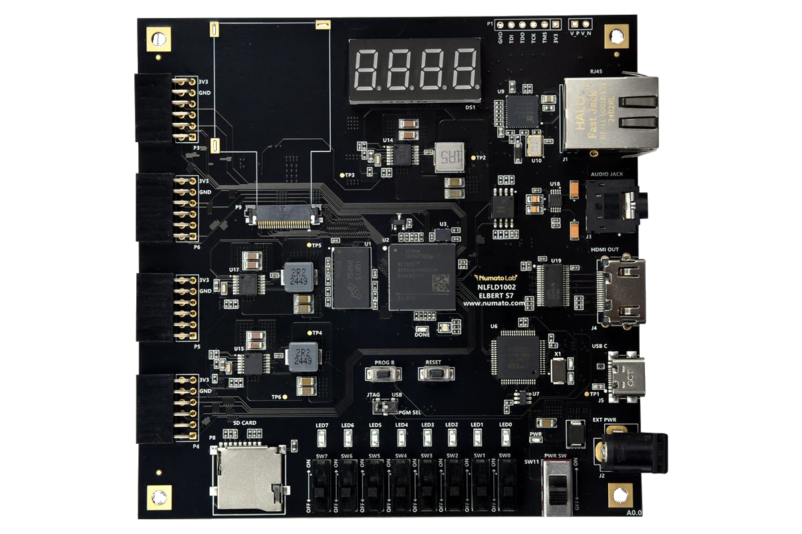

# Elbert-S7

  

The **Elbert S7** is a compact and beginner-friendly FPGA development board based on the AMD Spartan-7 device. It is designed to help learners and developers explore digital design, hardware interfacing, and embedded system concepts using AMD Vivado tools.

This repository contains a collection of **sample hardware projects** developed in **Vivado 2024.1** for the **Elbert S7**. These projects serve as reference implementations to test and demonstrate various on-board peripherals and interfaces. Below table lists all the test projects for Elbert S7.

---

| No. | Project Title                                                                                     | Description                                                      |
|-----|---------------------------------------------------------------------------------------------------|------------------------------------------------------------------|
| 1.  | **UART Communication – Printing “Hello World”**                                                   | Basic UART communication using a terminal to print messages.     |
| 2.  | **Controlling Onboard Peripherals (LEDs and Seven Segment Display) with Slide Switches**          | Controls onboard peripherals using hardware slide switches.      |
| 3.  | **HDMI Output Example Design**                                                                    | Displays test pattern output via HDMI from the FPGA.             |
| 4.  | **DDR3 Mem Test on Elbert S7**                                                                    | Tests read/write operations on the onboard DDR3 memory.          |
| 5.  | **Gigabit Ethernet Example Design**                                                               | Demonstrates Ethernet communication using the onboard PHY.       |
| 6.  | **SD Card Test**                                                                                  | Performs SPI-based SD card read/write operations using Vitis.    |
| 7.  | **Audio Jack Test**                                                                               | Audio codec or PWM-based sound generation                        |

## ⚙️ Requirements

- **Vivado Design Suite 2024.1**
- **Elbert S7 FPGA Board**
- USB Type C cable (for programming and powering Up the Board)
- Windows OS for running batch files
- Terminal software (e.g., PuTTY, Tera Term) for UART-based tests

## 📘 Project Descriptions  
   
   ### 1. UART Communication – Printing “Hello World”
     
   #### 🔧 To run a project:
   Navigate to the Hello_world project's folder `test` directory `Hello_world/test/` and Double-click on the corresponding `Hello_world.bat` file to program the FPGA.
  
   **NOTE:** Before running the batch file, make sure to update its path to match your Vivado installation directory. This is necessary for the batch file to run correctly.

   for ex: C:\Xilinx\Vitis\2024.1\bin\xsct.bat (this path should be edited inside the batch file to match your vivado installation directory)
 
   Before programming open the serial terminal of corresponding COM port with baudrate of 9600.
  
   #### 📝 Description:
   This project serves as a basic sanity check to ensure the UART peripheral is functioning correctly and that the board can transmit data over a serial connection. It also helps familiarize users with integrating    IP cores and observing output through a terminal emulator like Tera Term or PuTTY.

  ### 2. Controlling Onboard Peripherals (LEDs and Seven Segment Display) with Slide Switches
     
  #### 🔧 To run a project:
  Navigate to the Peripheral_test project's folder `test` directory `Peripheral/test/` and Double-click on the corresponding `Peripheral_test.bat` file to program the FPGA.
  
  **NOTE:** Before running the batch file, make sure to update its path to match your Vivado installation directory. This is necessary for the batch file to run correctly.

  for ex: C:\Xilinx\Vitis\2024.1\bin\xsct.bat (this path should be edited inside the batch file to match your vivado installation directory)
 
  
  #### 📝 Description:
  This project demonstrates how to interface and control key onboard peripherals LEDs and Seven Segment Display connectors-using the slide switches on the Elbert S7 FPGA board. It serves as a foundational         experiment to understand how input signals (from switches) can control output peripherals in an FPGA-based system.
  
  The design includes predefined behaviours:

   - When no switch is active, the seven-segment displays continuously count from 0 to 9 (same digit on all displays), while the LEDs perform a running light pattern.

   - When specific switches are turned ON, the system displays corresponding values:

    - Switch 1 (SW0): The seven-segment shows 3, and its binary representation (00000011) is shown on the LEDs.
  
    - Switch 2 (SW1): The seven-segment shows 5, and the LEDs display 00000101.
  
    - Switch 3 (SW2): The seven-segment shows 7, and the LEDs display 00000111.
  
This project is designed as a basic interface demo. You are encouraged to modify the functionality-such as changing the numbers shown on the seven-segment display, customizing LED patterns to suit your specific application needs or to experiment with your own designs. By completing this project, you’ll gain hands-on experience with I/O interfacing, logic control based on inputs.

   ### 3. HDMI Output Example Design
     
   #### 🔧 To run a project:
   Navigate to the HDMI project's folder `test` directory `HDMI/test/` and Double-click on the corresponding `HDMI.bat` file to program the FPGA.
  
   **NOTE:** Before running the batch file, make sure to update its path to match your Vivado installation directory. This is necessary for the batch file to run correctly.

   for ex: C:\Xilinx\Vitis\2024.1\bin\xsct.bat (this path should be edited inside the batch file to match your vivado installation directory)
 

   #### 📝 Description:
   This project generates a color bar test pattern and outputs it through the HDMI interface to an external display. It is useful for verifying video timing, pixel clock configuration, and HDMI signal integrity   on the Elbert S7 board.

   ### 4. DDR3 Mem test on ELBERT S7
     
   #### 🔧 To run a project:
   Navigate to the HDMI project's folder `DDR3` directory `DDR3/test/` and Double-click on the corresponding `DDR3.bat` file to program the FPGA.
  
   **NOTE:** Before running the batch file, make sure to update its path to match your Vivado installation directory. This is necessary for the batch file to run correctly.

   for ex: C:\Xilinx\Vitis\2024.1\bin\xsct.bat (this path should be edited inside the batch file to match your vivado installation directory)
    
   Before programming open the serial terminal of corresponding COM port with baudrate of 9600.

   #### 📝 Description:
   This project performs a basic memory test to validate the onboard DDR3 interface. It writes data to DDR3 memory and reads it back to ensure correct functionality, verifying the memory controller, timing      constraints, and signal integrity.

  ### 5. Gigabit Ethernet Example Design
     
   #### 🔧 To run a project:
   Navigate to the HDMI project's folder `Ethernet` directory `Ethernet/test/` and Double-click on the corresponding `ethernet.bat` file to program the FPGA.
  
   **NOTE:** Before running the batch file, make sure to update its path to match your Vivado installation directory. This is necessary for the batch file to run correctly.

   for ex: C:\Xilinx\Vitis\2024.1\bin\xsct.bat (this path should be edited inside the batch file to match your vivado installation directory)
    
   Before programming open the serial terminal of corresponding COM port with baudrate of 9600.

   #### 📝 Description:
   Implements a simple  Echo Server using the onboard Ethernet PHY. The FPGA receives UDP packets and sends them back to the sender, demonstrating Ethernet communication and lwIP stack integration on the  Elbert  S7 platform.

  ### 6. SD card test
     
   #### 🔧 To run a project:
   Navigate to the HDMI project's folder `SD_card` directory `SD_card/test/` and Double-click on the corresponding `SD.bat` file to program the FPGA.
  
   **NOTE:** Before running the batch file, make sure to update its path to match your Vivado installation directory. This is necessary for the batch file to run correctly.

   for ex: C:\Xilinx\Vitis\2024.1\bin\xsct.bat (this path should be edited inside the batch file to match your vivado installation directory)
    
   Before programming open the serial terminal of corresponding COM port with baudrate of 9600.

   #### 📝 Description:
   This project demonstrates interfacing with an SD card via the SPI protocol. It performs raw block-level read and write operations, validating SPI communication and SD card controller setup using a Vitis application.

   ### 7. Audio jack
     
   #### 🔧 To run a project:
   Navigate to the HDMI project's folder `Audio` directory `Audio/test/` and Double-click on the corresponding `Audio.bat` file to program the FPGA.
  
   **NOTE:** Before running the batch file, make sure to update its path to match your Vivado installation directory. This is necessary for the batch file to run correctly.

   for ex: C:\Xilinx\Vitis\2024.1\bin\xsct.bat (this path should be edited inside the batch file to match your vivado installation directory)
    
   Before programming open the serial terminal of corresponding COM port with baudrate of 9600.

   #### 📝 Description:
   Generates an audio tone or waveform and sends it to the onboard 3.5 mm audio jack. This test verifies the PWM/DAC-based audio output path.
